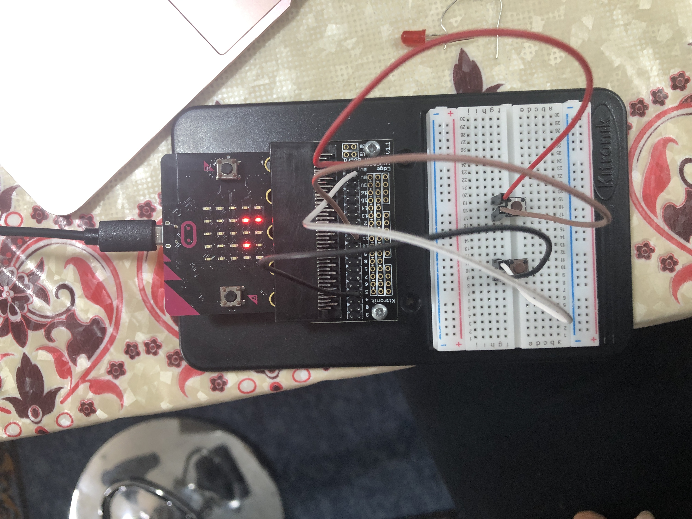
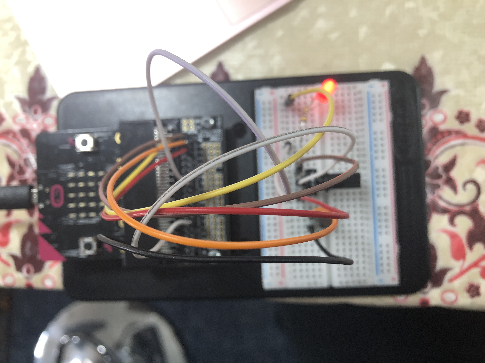
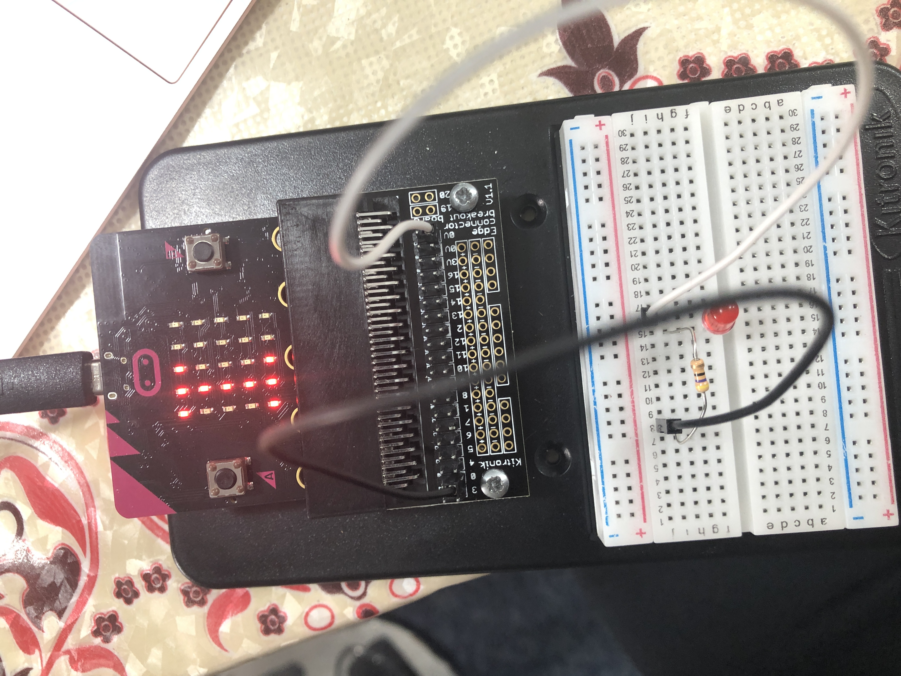

# Inventor Kit Experiments

*Markdown reference: https://guides.github.com/features/mastering-markdown/*

## Instructions ##

*For a selection of 5 inventor kit experiments that you choose, fill out the following sections.

### Experiment name ###

SAY "HELLO" TO THE BBC micro:bit!

#### Photo of completed project ####

Successful Experiement

#### Reflection ####

In this experiment, something new to me was or something I learned was how to operate a switch as this was my first experiement that had it listed.

This experiment could be the basis of a real world application such as gaming electronics or mobile devices.

### Experiment name ###

USING A LIGHT SENSOR & ANALOG INPUTS

#### Photo of completed project ####

Numerous Attempts Needed

#### Reflection ####

In this experiment, something new to me was or something I learned was to be careful when selecting the materials and I also found that it is very specific in terms of which legs of the transistor you use.

This experiment could be the basis of a real world application that could be implemented into vehicles, instead of manually switching on night lights, auto light sensors can detect it and dim or brighten your dashboad.

### Experiment name ###

DIMMING A LED USING A POTENTIOMETER

#### Photo of completed project ####

EXTRA WORK

#### Reflection ####

In this experiment, something new to me was or something I learned was our equipment isn't assembled like the ones used in class, therefore it's important to go over what you are missing... like the knob for the potentiometer.

This experiment could be the basis of a real world application that involve constant maintainence, one that comes to mind is stage lighting or volume checks, which allow adjustment in those areas.

### Experiment name ###

SETTING THE TONE WITH A PIEZO BUZZER

#### Photo of completed project ####

EASY, STRAIGHTFORWARD INSTRUCTIONS

#### Reflection ####

In this experiment, something new to me was or something I learned was how to build and code an experiment with a buzzer as i had never before.

This experiment could be the basis of a real world application such as devices that produce signals through sound by the push of a button, e.g. doorbells.

### Experiment name ###

MAKING A GAME USING A COMPASS

#### Photo of completed project ####

JAVASCRIPT CODING

#### Reflection ####

In this experiment, something new to me was or something I learned was to create a javascript code.

This experiment could be the basis of a real world application where more navigational systems are implemented in new and upcoming technology.

