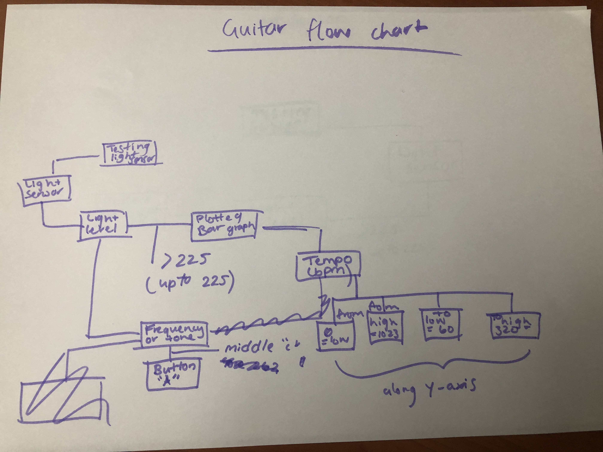

# Assessment 1: Replication project

*Fill out the following workbook with information relevant to your project.*

*Markdown reference:* [https://guides.github.com/features/mastering-markdown/](http://guides.github.com/features/mastering-markdown/)

## Replication project choice ##
Guitar

## Related projects ##

### Related project 1 ###
(Fun Theory Piano)

(https://adage.com/creativity/work/fun-theory-piano-staircase/17522)

This project is related to mine because it includes a muscial aspect that others can interact with and enjoy. I find it an intersting project because it encourages people to take the more active route on their travels.

### Related project 2 ###
(QUT Cube)

(https://www.qut.edu.au/news?id=157128)

This project is related to mine because it brings something realistic to the public. The cube offers and provides an experience to witness things such as the Great Barrier Reef as if people were really there. My project provides someone who can't play guitar, such as myself, a chance of experincing something even remotely closer to the real thing. 

### Related project 3 ###
(Swatchmate Cube)

(https://newatlas.com/swatchmate-color-capturing-cube/30355/)

This project is 

### Related project 4 ###
(Tashia Tucker- Interactive floor)

(https://www.homecrux.com/drexels-interactive-projects-that-improves-upon-our-daily-environment/7713/)

This project is related to mine in a very minor way, Tucker's project was described to be 'The future od adaptive living spaces' mine is just an ordianry home made guitar. However both of projects have sensors implemented or coded to detect human interaction and therefore respond to it.

### Related project 5 ###
(The harp of the city)

(http://joshuawilkinsonsd.com/the-harp-of-the-city)

This project is related to mine because 

### Related project 6 ###
(Westfield Garden City interactive game wall)

(https://adage.com/creativity/work/fun-theory-piano-staircase/17522)

This project is related to mine because the owners of the centre explain that it is a revitalise that customers willbe excited to see and be apart of. I see that in my project as well. While it still appears to be a rough prototype replication, it concept of it does "spruce" things up from a ordinary guitar as this is more of an electronic instrument. Even better, it's home made. 

## Reading reflections ##
*Reflective reading is an important part of actually making your reading worthwhile. Don't just read the words to understand what they say: read to see how the ideas in the text fit with and potentially change your existing knowledge and maybe even conceptual frameworks. We assume you can basically figure out what the readings mean, but the more important process is to understand how that changes what you think, particularly in the context of your project.*

*For each of the assigned readings, answer the questions below.*

### Reading: Don Norman, The Design of Everyday Things, Chapter 1 (The Psychopathology of Everyday Things) ###

*What I thought before: Describe something that you thought or believed before you read the source that was challenged by the reading.* 

That there wasn't alot of things to consider when designing things. I guess I would say, I thought it was more centred around the look of it, how it worked, if it was something people would like. And thought Norman does discuss this in the reading, I thought very vaguely of it, but was shown a whole different side to the thought process. 

*What I learned: Describe what you now know or believe as a result of the reading. Don't just describe the reading: write about what changed in YOUR knowledge.*

Before reading this I had known that planning a design was a key part. However, this reading goes into further depth about how others can perceive things different. After reading this, it's come alot more clearer that there are many many things to conisder like whether signifers will be interpreted the wrong way, or how one control can effect a wide range of things, therefore it's important to carefully plan and consider and quite possibly have others review your ideas. 

*What I would like to know more about: Describe or write a question about something that you would be interested in knowing more about.* 
Is the psychological side more important than other aspects of design?

*How this relates to the project I am working on: Describe the connection between the ideas in the reading and one of your current projects or how ideas in the reading could be used to improve your project.*

To take into account some of the psychological concepts. Feedback would have to be a main one in my project. Alot of times I had to play around and experiment with movement. Since my project is responsive to movement and changes the way it sounds accordingly to where in the air its placed or how firmly I press on the microbit. There were times where I was making constant adjustments in placing sticky tape, otherwise if in the wrong place, audio would fall out or be uneven. 

### Reading: Chapter 1 of Dan Saffer, Microinteractions: Designing with Details, Chapter 1 ###

*What I thought before: Describe something that you thought or believed before you read the source that was challenged by the reading.*

It had never occurred to me that microinteractions were something to consider to be in design and technology. 

*What I learned: Describe what you now know or believe as a result of the reading. Don't just describe the reading: write about what changed in YOUR knowledge.* 

There is more than meets the eye. In saying that, again, microinterations was something i'd never expect to hear in a world of design, but more so the biological side of things like human anatomy or the connections between living organisms. But now having read that it has only woken me up to realise there is a lot of things that go into making one product into what it is. 

*What I would like to know more about: Describe or write a question about something that you would be interested in knowing more about.*

 Are the sensors/detectors that we've worked with in class connected to microinteractions, since one of the things they are good at is turning features on or off? Just like a feature I planned to have in my project?

*How this relates to the project I am working on: Describe the connection between the ideas in the reading and one of your current projects or how ideas in the reading could be used to improve your project.*
Stated above, I feel once I understand how or if there is a connection between sensors and microinteractions I would then get closer to implementing more things to my guitar.

### Reading: Scott Sullivan, Prototyping Interactive Objects ###

*What I thought before: Describe something that you thought or believed before you read the source that was challenged by the reading.*

That you had to be somewhat of an expert in the field of design if you were going to make it fair or even have any chance of success. 

*What I learned: Describe what you now know or believe as a result of the reading. Don't just describe the reading: write about what changed in YOUR knowledge.*  

I would say reading this, I'd come out of it a bit more relieved, confident and reassured. As this whole time I felt a sense of intimidation in the world of design and that it's a bad thing if you're new and learning slowly. Sullvian quickly debunks this at the very start. This was a main part that stuck to me. 

*What I would like to know more about: Describe or write a question about something that you would be interested in knowing more about.*

I understand that the world of design is alwas changing and there are things you lean constantly as you go. But at what point or how much time is needed to become familiar with the concepts surrounding design?

*How this relates to the project I am working on: Describe the connection between the ideas in the reading and one of your current projects or how ideas in the reading could be used to improve your project.*

That the identified bugs in my project are something to expect, especially when I'm learning. However, with constant work and experiementing, an "ON" and "OFF" switch could hopefully be implemented. 
And also make more room and time for beta testing as a way to collect feedback on what works and what doesn't. 

## Interaction flowchart ##

## Process documentation ##

To begin my project, I first had to find some inspiration on the type of shape and type of guitar I wanted to recreate in terms of appearance. This was more so the creative aesthetic side instead of the technical side. I chose to go with a fender electric stratocaster guitar. Wasn't anything particular about it, it's just the shape was more appealing to me. However, I didn't achieve the full look as I lacked in materials to decorate with as my top priority was having it function. 

Below are the materials I used which I got from referring from the link that was provided in the assesment template. Most of which were household items. Note that some things in the image are missing but were later collected (such as aluminuium foil).

A problem I was stuck with for a bit was getting my hands on crocodile jumper heads. This came due to my lack of knowledge and experience. I wasn't aware the Inventor's kit didn't provide them, so I had to take it upon myself to go out and find them. These were sourced from Bunnings Warehouse. Due to these being very different from the ones used in class and my lack of knowledge, I had no idea how to connect the heads with the wires provided with the kit. I sourced out youtube videos, in hopes that it would help... they did not as the wires were different. I later played around with the heads and wires and soon found out how they worked.

I first made an outline of my guitar on a flattened out piece of cardboard (which was originally boxed). The recommended length was about 40-80cm. Mine was roughly 82.5cm, serving a good size. 

Complications came with cutting out the shape, which found itself to be very time consuming. I found this due to the tools I was using. The scissors used weren't best suited for cardboard, which left small pains in my hand after a couple of cuts. The stanely knife wasn't sharp enough, therefore a couple of strides were needed to cut through.

I sensed the use of using cardboard that was originally boxed left it very flimsy, however this was a quick fix, as extra layers or cardboard and tape were used to create a sturdier material. 

## CODES ##

### LIGHT SENSOR ###

### BEAT CONTROL ###

### ON AND OFF SWITCH CODE ###

### Project title ###
GUITAR REPLICATION

### Project description ###

This project is a electronic musical instrument in hopes to bring a close real life feel to playing an actual guitar. This project makes it so that anyone can play any instrument. 

### Showcase image ###

### Additional view ###

### Reflection ###

Overall the replication of the project was successful. Plenty room for improvement seeing as it was my first design project. One of the highlights was teaching myself new things (that may seem small) like wiring up crocodile heads with wires. However the most successful thing to come out of this is having the guitar show its function. 

However, though the replication was successful, there are still some aspects that were hard to work around or figure out. For example coding, I found throughout this process, it took me a while to understand why things were put together the way they were. Or some things just didn't work through the microbit. ALthough these weren't any major problems that stopped the central goal of having it work and play sounds. It still would have been a rewarding feeling knowing i accomplised all of it. 

One of my coding problems was the "on" and "off" switch, which didn't seem to work. I followed the steps provided, however as I am new to all of this, I may have coded incorrectly or placed wires in the wrong sections. 

Looking back at this whole process, I would recommended to myself to explore more sources to see if there were other alternatives or approaches for more inspiration. Now realising I'm not as limited to what I thought I was. 

Looking back at it now I wish there was a more pleasing aesthetic look to it. Keeping in mind for next time that the look of it should be considered and thought out as much as the technical side. 

